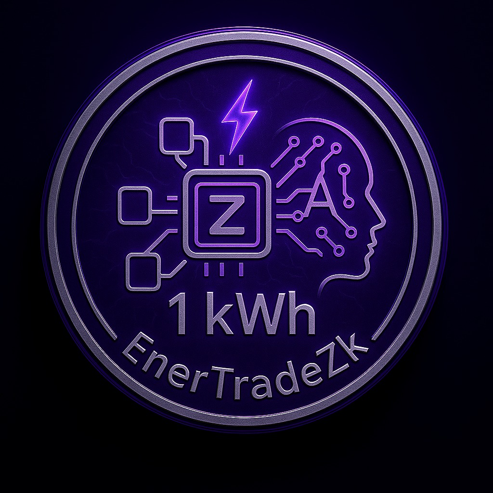

  

# ⚡ EnerTradeZK - Tokenize sua Energia. Libere seu Poder.

EnerTradeZK é uma plataforma descentralizada que transforma energia em ativo digital acessível, negociável e seguro. Utilizando blockchain, inteligência artificial e provas de conhecimento zero (ZK), permitimos que qualquer pessoa compre, venda ou invista em energia com segurança, autonomia e privacidade.

---

## 📘 Visão Geral da Aplicação

**Problema que resolvemos:**  
Milhões de brasileiros enfrentam contas de luz altas, sem transparência, previsibilidade ou liberdade de escolha. O mercado de energia atual é burocrático, centralizado e inacessível para pequenos consumidores.

**Nossa Solução:**  
A EnerTradeZK cria uma ponte para o mercado livre de energia. Com nossa plataforma, 1 kWh vira 1 token. Usuários podem tokenizar, negociar e investir em energia de forma simples, segura e escalável.

**Público-alvo:**  
Consumidores finais, pequenos geradores, investidores em energia e comunidades interessadas em fontes renováveis.

**Objetivo do MVP:**  
Demonstrar como energia pode ser tratada como ativo digital, viabilizando negociações P2P com privacidade e validação técnica/jurídica por meio de provas ZK.

---

## ⚙️ Funcionalidades

### MVP
- Negociação direta entre usuários com ordens de compra e venda de energia tokenizada.
- Cancelar ordens de vendas anunciadas anteriomente
- Informações da sua carteira, com quantidade de tokens, lucro das operações e resumo da carteira caso converta tokens em preço unitário atual (fictícios)
- Histórico de transações da plataforma
  
### Próximas funcionalidades
- **Tokenização energética automatizada:** Insira os dados do contrato e gere tokens EnerZ com poucos cliques.
- **Provas ZK (Zero Knowledge):** Garantia de privacidade na validação de produção e consumo.
- **Contratos futuros e fracionamento:** Negocie energia como em uma bolsa de ativos, com previsibilidade e flexibilidade.
- **Arduino + IA embarcada:** Dispositivos físicos com sensores alimentam a plataforma com dados reais para previsões de demanda e consumo.
- **Oráculos de energia:** Integração com fontes como Chainlink para obter preços atualizados do MWh.

🔗 **Acesse o MVP:**  
[[https://ener-trade-zk.vercel.app](https://ener-trade-zk.vercel.app)](https://enertrade-zk.vercel.app/)

---

## 🧰 Tecnologias e Ferramentas Utilizadas

**Backend:**
- Solidity (contratos inteligentes)
- Hardhat (ambiente de testes)
- Circom + Snarkjs (geração/verificação de provas ZK)
- Node.js
- Infura + MetaMask (conectividade com Ethereum Sepolia testnet)

**Frontend:**
- React.js
- Vite
- Tailwind CSS
- ethers

**Hardware e IA:**
- Arduino com sensores
- Inteligência Artificial embarcada para análise de consumo (via zK Verify)
- Chainlink para dados externos (oráculos)

---

## 💸 Monetização

Nosso modelo de negócios é escalável e sustentável:
- Taxas de transação na plataforma
- Serviços premium para usuários avançados
- Emissão white label de tokens personalizados
- Consultorias B2B para integradores energéticos
- Leilões de energia tokenizada

---

## 🌱 Sustentabilidade e Impacto

- Incentivo à geração distribuída e uso de fontes renováveis  
- Redução da dependência de distribuidores centrais  
- Expansão da energia limpa, com impacto positivo no meio ambiente  
- Inclusão energética de regiões remotas com menor acesso à rede

---

## 🧩 Estrutura do Time

**Eduardo Ferreira da Silva** – Ideador / Líder  
**Roberto da Rocha Pimentel Júnior** – Backend / Web3 / Documentação  
**Victor Venturelli Mafra** – Frontend / Web3 / Documentação  
**Andre Luis Gottardi Marcal** – UX / Design / Gestão / Facilitação  

📩 **Contato para parcerias e dúvidas:**  
[contato@edugera.com.br](mailto:contato@edugera.com.br)

---

## 🔮 Próximos Passos

- Adição funcionalidades mencionadas anteriormente
  - Integração com IA
- Onboarding para usuários leigos com tutoriais interativos  
- Suporte a múltiplas línguas (inglês, espanhol etc.)  
- Expansão para outros tipos de energia (marés, geotérmica)  
- Parcerias com cooperativas energéticas e governos

---

## 📄 Documentação Técnica

- [📂 Front-end README](./front-end/README.md)
- [📂 Back-end README](./back-end/README.md)

---

## 🚀 Como Rodar Localmente

Acesse os READMEs específicos de cada parte do projeto nos links acima para instruções detalhadas de instalação e execução.

---

> **EnerTradeZK** — A plataforma que transforma energia em autonomia, investimento e inovação.
> **Tokenize sua energia. Libere seu poder.**
