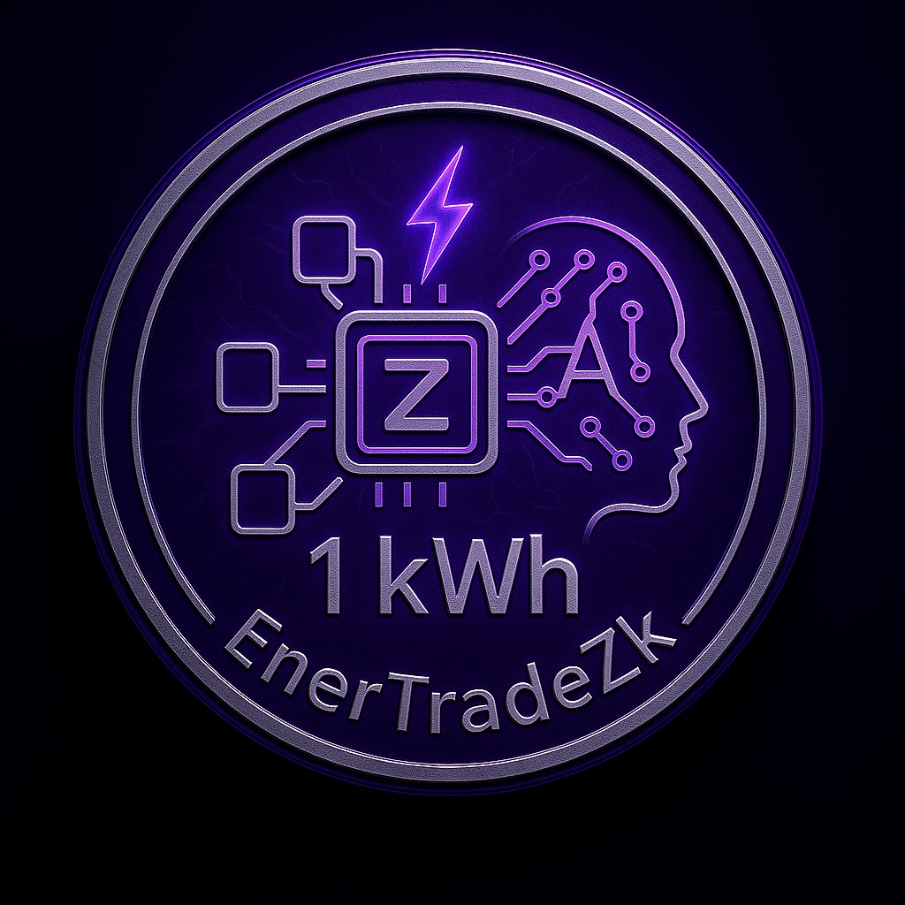

# ⚡ EnerTradeZK - Plataforma de Trading de Energia com Zero Knowledge

EnerTradeZK é uma plataforma descentralizada para trading de energia utilizando provas de conhecimento zero (Zero Knowledge Proofs) para garantir privacidade e segurança nas transações.

---

## 📊 Linguagens utilizadas no projeto


---

## 🚀 Funcionalidades

- **Token EnerZ**: Token ERC20 para representar unidades de energia
- **Exchange Descentralizada**: Plataforma P2P para trading de energia
- **Provas de Conhecimento Zero**: Verificação de saldo sem revelar o valor exato
- **Sistema de Listagens**: Criação e gerenciamento de ofertas de energia

## 📋 Pré-requisitos

- Node.js (versão 16 ou superior)
- npm ou yarn
- MetaMask
- Conta no Infura

## 🔧 Instalação

1. Clone o repositório:
```bash
git clone https://github.com/seu-usuario/EnerTradeZK.git
cd back-end
```

2. Instale as dependências:
```bash
npm install
```

3. Configure as variáveis de ambiente:
Crie um arquivo `.env` na raiz do projeto com as seguintes variáveis:
```
PRIVATE_KEY=sua_chave_privada_metamask
INFURA_PROJECT_ID=seu_project_id_infura
```

## 🏗️ Contratos Deployados (Sepolia)

- **EnerZ**: `0xaB658d27EFbB5582bfdb4edc835CC12342fDf24E`
- **Groth16Verifier**: `0x45fFe2034897736d0Aa9FC4f51375df007265095`
- **Exchange**: `0x52c7949162d267eD3ff2AF191380c216Dc92d465`

## 📝 Estrutura do Projeto

```
EnerTradeZK/
├── contracts/              # Contratos Solidity
│   ├── EnerZ.sol          # Token ERC20
│   ├── Exchange.sol       # Contrato de Exchange
│   └── Groth16Verifier.sol # Verificador de provas ZK
├── circuits/              # Circuitos Circom
│   └── balance_proof.circom # Circuito de prova de saldo
├── scripts/               # Scripts de deploy
└── test/                  # Testes
```

## 🚀 Deploy

Para fazer o deploy dos contratos na rede Sepolia:

```bash
npx hardhat run scripts/deploy.js --network sepolia
```

## 🔍 Uso

1. **Depósito de Energia**:
```solidity
function deposit(uint256 amount)
```

2. **Criação de Listagem**:
```solidity
function createListing(uint256 amount, uint256 price)
```

3. **Compra de Energia**:
```solidity
function buyListing(uint256 listingId)
```

4. **Verificação de Saldo (ZK)**:
```solidity
function verifyBalanceProof(uint256[2] memory a, uint256[2][2] memory b, uint256[2] memory c, uint256[1] memory input)
```

## 🛠️ Tecnologias Utilizadas

- Solidity
- Hardhat
- Circom
- SnarkJS
- OpenZeppelin
- Infura
- MetaMask

## 🔒 Segurança

- Contratos auditados
- Proteção contra reentrância
- Provas de conhecimento zero para privacidade
- Controle de acesso baseado em roles

## 📄 Licença

Este projeto está sob a licença MIT. Veja o arquivo [LICENSE](LICENSE) para mais detalhes.

## 🤝 Contribuição

1. Faça um Fork do projeto
2. Crie uma Branch para sua Feature (`git checkout -b feature/AmazingFeature`)
3. Commit suas mudanças (`git commit -m 'Add some AmazingFeature'`)
4. Push para a Branch (`git push origin feature/AmazingFeature`)
5. Abra um Pull Request
