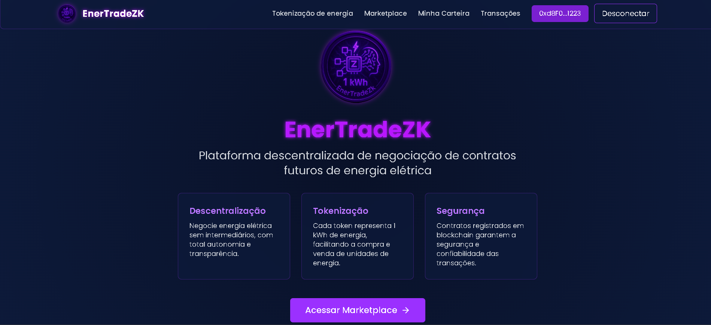

# 🚀 EnerTradeZK

Uma plataforma inovadora para negociação de tokens de energia, construída com tecnologias modernas e seguras, integrando Web3 e Zero-Knowledge Proofs para transações privadas e seguras.

## 📸 Demonstração



## 📦 Tecnologias Utilizadas

- ⚡ Vite - Build tool e servidor de desenvolvimento
- 🔷 TypeScript - Tipagem estática
- ⚛️ React - Biblioteca JavaScript para interfaces
- 🎨 Tailwind CSS - Framework CSS utilitário
- 🎯 shadcn-ui - Componentes UI reutilizáveis
- 🌐 Web3.js/Ethers.js - Integração com blockchain e carteiras Web3

## 📁 Estrutura de Pastas

```
front-end/
├── src/              # Código fonte da aplicação
│   ├── components/   # Componentes React reutilizáveis
│   ├── config/       # Configurações do Smart Contract
│   ├── pages/        # Páginas da aplicação
│   ├── services/     # Serviços e integrações
│   ├── hooks/        # Custom hooks (incluindo Web3)
│   ├── types/        # Objetos
│   ├── App.tsx       # Componente principal
│   └── main.tsx      # Ponto de entrada
└── public/           # Arquivos públicos
```

## 🛠️ Como Rodar o Projeto

**Pré-requisitos:**
- Node.js v20+
- npm
- MetaMask ou outra carteira Web3 instalada

```bash
# Clone o repositório
git clone https://github.com/vvmafra/EnerTradeZK

# Entre no diretório
cd front-end

# Instale as dependências
npm install

# Inicie o servidor de desenvolvimento
npm run dev

# Para build de produção
npm run build
```

## 🎯 Funcionalidades Principais

- 📊 Dashboard de negociação de tokens de energia
- 🔄 Sistema de tokens de energia
- 🔐 Integração com Zero-Knowledge Proofs
- 👛 Conexão com carteiras Web3 (MetaMask, WalletConnect)
- 💎 Suporte a múltiplas redes (Ethereum, Polygon, etc.)
- 🔒 Transações seguras e privadas

## 🌐 Conexão Web3

Para conectar sua carteira:
1. Clique no botão "Conectar Carteira"
2. Selecione sua carteira preferida
3. Aprove a conexão na sua carteira
4. Pronto! Você já pode começar a negociar tokens de energia

## 🚀 Deploy

O projeto está em produção na Vercel: [EnerTradeZK](https://ener-trade-zk.vercel.app/)

## 📞 Suporte

Para suporte abra uma issue no GitHub.
